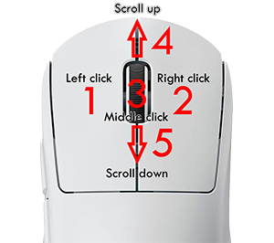

# Hooks
{: .no_toc }

## Table of contents
{: .no_toc .text-delta }

1. TOC
{:toc}

---

컴퓨터 프로그래밍에서 후킹(hooking)이란 용어란 운영체제나 어플리케이션, 다른 소프트웨어 들의 구성 요소간의 동작을 변경하거나 기능 확장을 위해 함수 호출, 메시지, 소프트웨어 구성 요소간에 전달되는 이벤트를 가로채는(hook) 다양한 테크닉을 말합니다. 이러한 가로챈 함수 호출, 이벤트, 메시지를 처리하는 코드를 hook라고 합니다.

## 소개

후킹은 디버깅 및 기능 확장 등 여러 목적을 위해 사용됩니다. 예를 들어, 애플리케이션에 도달하기 전에 키보드나 마우스 이벤트 메시지를 가로채거나, 운영 체제 호출을 가로채서 애플리케이션이나 다른 구성 요소의 동작을 모니터링하거나 수정하는 경우가 있습니다. 또한 후킹은 벤치마킹 프로그램에서 널리 사용됩니다. 예를 들어, 3D 게임에서 프레임 속도를 측정할 때, 출력 및 입력을 후킹을 통해 처리하는 방식입니다.

즉, 후킹은 MiniLibX의 핵심 기능이라 말할 수 있습니다.

## 키 이벤트 후킹하기

후킹은 어려운것처럼 보이지만 사실, 그렇게 어렵지 않습니다.
아래는 그 예제입니다:

```c
#include <mlx.h>
#include <stdio.h>

typedef struct	s_vars {
	void	*mlx;
	void	*win;
}				t_vars;

int	key_hook(int keycode, t_vars *vars)
{
	printf("Hello from key_hook!\n");
	return (0);
}

int	main(void)
{
	t_vars	vars;

	vars.mlx = mlx_init();
	vars.win = mlx_new_window(vars.mlx, 640, 480, "Hello world!");
	mlx_key_hook(vars.win, key_hook, &vars);
	mlx_loop(vars.mlx);
}
```

우리는 이제 키를 누를 때마다 메시지를 출력하는 함수를 등록했습니다. 보시다시피, 우리는 `mlx_key_hook`로 후킹 함수를 등록합니다. 그러나 백그라운드에서는 이 함수가 적절한 X11 이벤트 타입을 사용하여 mlx_hook 함수를 호출합니다. 이 부분은 다음 장에서 다룰 것입니다.

## 마우스 이벤트 후킹



또한, 마우스 이벤트도 후킹가능 합니다.

```c
mlx_mouse_hook(vars.win, mouse_hook, &vars);
```
Mouse code for MacOS:
  - Left click: 1
  - Right click: 2
  - Middle click: 3
  - Scroll up: 4
  - Scroll down : 5  


## Test your skills!

Now that you have a faint idea of what hooks are, we will allow you to create a
few of your own. Create hook handlers that whenever:
- a key is pressed, it will print the key code in the terminal.
- the mouse if moved, it will print the current position of that mouse in the
terminal.
- a mouse is pressed, it will print the angle at which it moved over the window
to the terminal.


